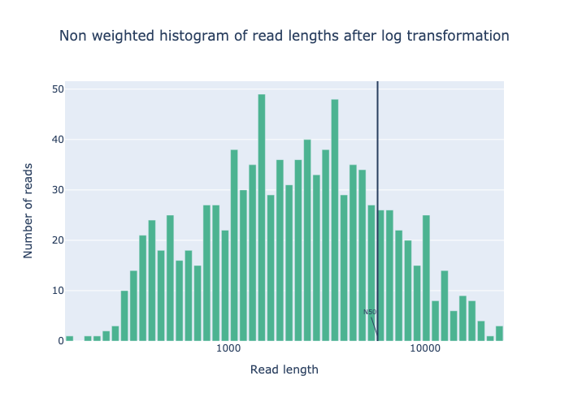
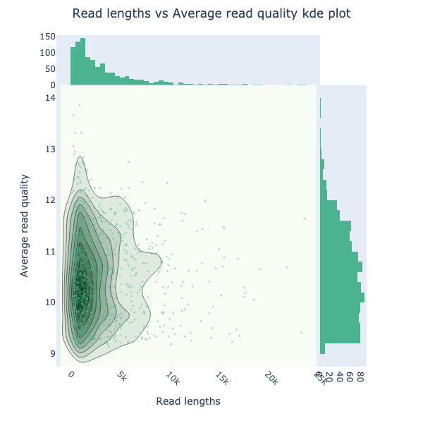

# GobyQC Workflow

GobyQC is a Nextflow pipeline for quality controlling the total run data from Oxford Nanopore fastqs. This pipeline uses [NanoPlot](https://github.com/wdecoster/NanoPlot), a plotting tool designed for long read sequencing data. 

**Input**: one, multiple or directory of .fastq files 

**Output**: .html report 

## Introduction

<!---This section of documentation typically contains a list of things the workflow can perform also any other intro.--->

This workflow can be used for the following:

1. To generate statistics on fastq files (total reads, total number of bps, N50)
2. Generate a read length distribution plot
    
4. Generate a read length vs quality score distribution plot
    

## Compute requirements

Recommended requirements:

+ CPUs = 2
+ Memory = 2GB

Minimum requirements:

+ CPUs = 2
+ Memory = 2GB

Approximate run time: ## ????

ARM processor support: True

## Install and run

<!---Nextflow text remains the same across workflows, update example cmd and demo data sections.--->
These are instructions to install and run the workflow on command line. You can also access the workflow via the [EPI2ME application](https://labs.epi2me.io/downloads/).

The workflow uses [Nextflow](https://www.nextflow.io/) to manage compute and software resources, therefore nextflow will need to be installed before attempting to run the workflow.

The workflow can currently be run using either [Docker](https://www.docker.com/products/docker-desktop) or
[Singularity](https://docs.sylabs.io/guides/3.0/user-guide/index.html) to provide isolation of
the required software. Both methods are automated out-of-the-box provided
either docker or singularity is installed. This is controlled by the [`-profile`](https://www.nextflow.io/docs/latest/config.html#config-profiles) parameter as exemplified below.

It is not required to clone or download the git repository in order to run the workflow.
More information on running EPI2ME workflows can be found on our [website](https://labs.epi2me.io/wfindex).

## Pipeline overview

<!---High level numbered list of main steps of the workflow and hyperlink to any tools used. If multiple workflows/different modes perhaps have subheadings and numbered steps. Use nested numbering or bullets where required.--->
### 1. 

### 2. 

