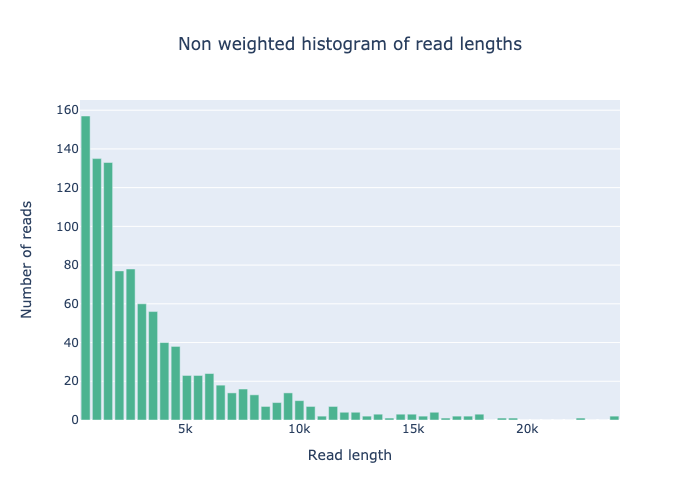
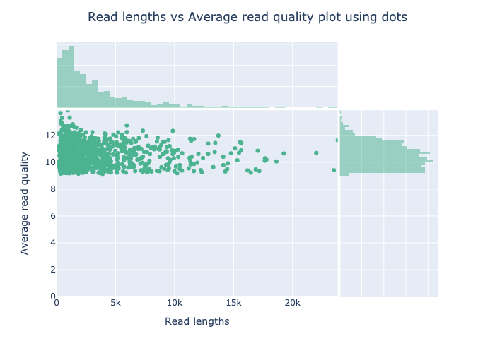

# GobyQC Workflow

GobyQC is a Nextflow pipeline for quality controlling the total run data from Oxford Nanopore fastqs. This pipeline uses [NanoPlot](https://github.com/wdecoster/NanoPlot), a plotting tool designed for long read sequencing data. 

**Input**: one, multiple or directory of .fastq files 

**Output**: .html report 


## Introduction

<!---This section of documentation typically contains a list of things the workflow can perform also any other intro.--->

This workflow can be used for the following:

1. To generate statistics on fastq files (total reads, total number of bps, N50)
2. Generate a read length distribution plot
    
4. Generate a read length vs quality score distribution plot
    

## Compute requirements

Recommended requirements:

+ CPUs = 2
+ Memory = 2GB

Minimum requirements:

+ CPUs = 2
+ Memory = 2GB

Approximate run time: ## ????

ARM processor support: True


## Install and run

<!---Nextflow text remains the same across workflows, update example cmd and demo data sections.--->
These are instructions to install and run the workflow on command line. You can also access the workflow via the [EPI2ME application](https://labs.epi2me.io/downloads/).

The workflow uses [Nextflow](https://www.nextflow.io/) to manage compute and software resources, therefore nextflow will need to be installed before attempting to run the workflow.

The workflow can currently be run using either [Docker](https://www.docker.com/products/docker-desktop) or
[Singularity](https://docs.sylabs.io/guides/3.0/user-guide/index.html) to provide isolation of
the required software. Both methods are automated out-of-the-box provided
either docker or singularity is installed. This is controlled by the [`-profile`](https://www.nextflow.io/docs/latest/config.html#config-profiles) parameter as exemplified below.

It is not required to clone or download the git repository in order to run the workflow.
More information on running EPI2ME workflows can be found on our [website](https://labs.epi2me.io/wfindex).

The following command can be used to obtain the workflow. This will pull the repository in to the assets folder of nextflow and provide a list of all parameters available for the workflow as well as an example command:

```
nextflow run epi2me-labs/wf-template –help
```
A demo dataset is provided for testing of the workflow. It can be downloaded using:
```
wget https://ont-exd-int-s3-euwst1-epi2me-labs.s3.amazonaws.com/wf-template/wf-template-demo.tar.gz
tar -xzvf wf-template-demo.tar.gz
```
The workflow can be run with the demo data using:
```
nextflow run epi2me-labs/wf-template \
--fastq wf-template-demo/test_data/reads.fastq.gz \
-profile standard
```
For further information about running a workflow on the cmd line see https://labs.epi2me.io/wfquickstart/


## Pipeline overview

<!---High level numbered list of main steps of the workflow and hyperlink to any tools used. If multiple workflows/different modes perhaps have subheadings and numbered steps. Use nested numbering or bullets where required.--->
### 1. Concatenates input files and generate per read stats.

The [fastcat/bamstats](https://github.com/epi2me-labs/fastcat) tool is used to concatenate multifile samples to be processed by the workflow. It will also output per read stats including average read lengths and qualities.


## Input example

<!---Example of input directory structure, delete and edit as appropriate per workflow.--->
This workflow accepts FASTQ(s) as input.

The FASTQ or BAM input parameters for this workflow accept one of three cases: (i) the path to a single FASTQ or BAM file; (ii) the path to a top-level directory containing FASTQ or BAM files; (iii) the path to a directory containing one level of sub-directories which in turn contain FASTQ or BAM files. In the first and second cases (i and ii), a sample name can be supplied with `--sample`. In the last case (iii), the data is assumed to be multiplexed with the names of the sub-directories as barcodes. In this case, a sample sheet can be provided with `--sample_sheet`.

```
(i)                     (ii)                 (iii)    
input_reads.fastq   ─── input_directory  ─── input_directory
                        ├── reads0.fastq     ├── barcode01
                        └── reads1.fastq     │   ├── reads0.fastq
                                             │   └── reads1.fastq
                                             ├── barcode02
                                             │   ├── reads0.fastq
                                             │   ├── reads1.fastq
                                             │   └── reads2.fastq
                                             └── barcode03
                                              └── reads0.fastq
```


## Input parameters

### Input Options

| Nextflow parameter name  | Type | Description | Help | Default |
|--------------------------|------|-------------|------|---------|
| fastq | string | FASTQ files to use in the analysis. | This accepts one of three cases: (i) the path to a single FASTQ file; (ii) the path to a top-level directory containing FASTQ files; (iii) the path to a directory containing one level of sub-directories which in turn contain FASTQ files. In the first and second case, a sample name can be supplied with `--sample`. In the last case, the data is assumed to be multiplexed with the names of the sub-directories as barcodes. In this case, a sample sheet can be provided with `--sample_sheet`. |  |
| bam | string | BAM or unaligned BAM (uBAM) files to use in the analysis. | This accepts one of three cases: (i) the path to a single BAM file; (ii) the path to a top-level directory containing BAM files; (iii) the path to a directory containing one level of sub-directories which in turn contain BAM files. In the first and second case, a sample name can be supplied with `--sample`. In the last case, the data is assumed to be multiplexed with the names of the sub-directories as barcodes. In this case, a sample sheet can be provided with `--sample_sheet`. |  |
| analyse_unclassified | boolean | Analyse unclassified reads from input directory. By default the workflow will not process reads in the unclassified directory. | If selected and if the input is a multiplex directory the workflow will also process the unclassified directory. | False |
| watch_path | boolean | Enable to continuously watch the input directory for new input files. | This option enables the use of Nextflow’s directory watching feature to constantly monitor input directories for new files. | False |
| fastq_chunk | integer | Sets the maximum number of reads per chunk returned from the data ingress layer. | Default is to not chunk data and return a single FASTQ file. |  |


### Sample Options

| Nextflow parameter name  | Type | Description | Help | Default |
|--------------------------|------|-------------|------|---------|
| sample_sheet | string | A CSV file used to map barcodes to sample aliases. The sample sheet can be provided when the input data is a directory containing sub-directories with FASTQ files. | The sample sheet is a CSV file with, minimally, columns named `barcode` and `alias`. Extra columns are allowed. A `type` column is required for certain workflows and should have the following values; `test_sample`, `positive_control`, `negative_control`, `no_template_control`. |  |
| sample | string | A single sample name for non-multiplexed data. Permissible if passing a single .fastq(.gz) file or directory of .fastq(.gz) files. |  |  |


### Output Options

| Nextflow parameter name  | Type | Description | Help | Default |
|--------------------------|------|-------------|------|---------|
| out_dir | string | Directory for output of all workflow results. |  | output |


## Outputs

Output files may be aggregated including information for all samples or provided per sample. Per-sample files will be prefixed with respective aliases and represented below as {{ alias }}.

| Title | File path | Description | Per sample or aggregated |
|-------|-----------|-------------|--------------------------|
| workflow report | ./wf-template-report.html | Report for all samples | aggregated |
| Per file read stats | ./fastq_ingress_results/reads/fastcat_stats/per-file-stats.tsv | A TSV with per file read stats, including all samples. | aggregated |
| Per read stats | ./fastq_ingress_results/reads/fastcat_stats/per-read-stats.tsv | A TSV with per read stats, including all samples. | aggregated |
| Run ID's | ./fastq_ingress_results/reads/fastcat_stats/run_ids | List of run ID's present in reads. | aggregated |
| Meta map json | ./fastq_ingress_results/reads/metamap.json | Meta data used in workflow presented in a JSON. | aggregated |
| Concatenated sequence data | ./fastq_ingress_results/reads/{{ alias }}.fastq.gz | Per sample reads concatenated in to one fastq file. | per-sample |


## Troubleshooting

<!---Any additional tips.--->
+ If the workflow fails please run it with the demo data set to ensure the workflow itself is working. This will help us determine if the issue is related to the environment, input parameters or a bug.
+ See how to interpret some common nextflow exit codes [here](https://labs.epi2me.io/trouble-shooting/).


